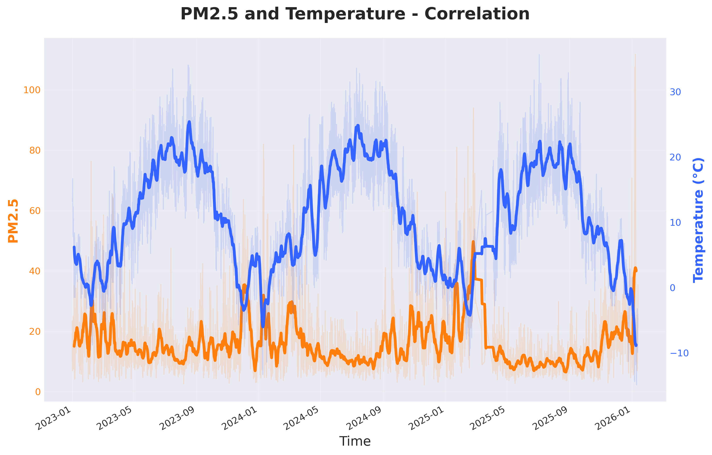
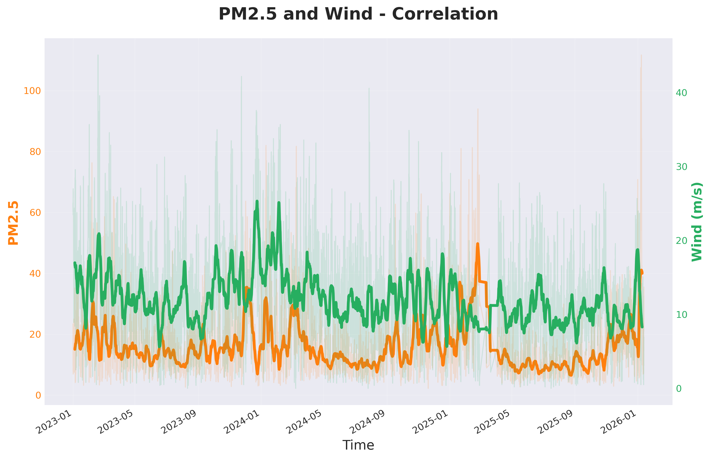

# Model

## Goal
The primary objective of this module is to implement a robust Machine Learning pipeline designed to predict air pollution levels, specifically focusing on the concentration of **PM2.5 particles**.

The system aims to model the complex, non-linear relationships between air quality and various **meteorological parameters** (including temperature, wind speed, atmospheric pressure, and humidity).

## Description
The designed system utilizes a **Random Forest Regressor**, an ensemble model from `sklearn.ensemble` library. It was optimized through Time Series Cross-Validation and Grid Search.

The project architecture integrates directly with a PostgreSQL database and executes the following stages:

### Data Processing and Feature Engineering
The pipeline establishes a connection to a PostgreSQL database to retrieve historical weather and pollution data. It merges datasets based on timestamps, handles missing values, and prepares the dataset for regression analysis.

A critical step is the **transformation of temporal variables** (Hour, Month) into cyclical features using **sine and cosine functions** to preserve temporal continuity. This ensures that the model understands that Hour 23 is proximally close to Hour 0, and December is close to January.

### Model Training and Optimization
The system utilizes `RandomForestRegressor` due to its ability to handle non-linear relationships. Hyperparameters (`n_estimators`, `max_depth`) were tuned using `GridSearchCV`.

### Validation Strategy
To ensure robustness, the project implements `TimeSeriesSplit` to respect the temporal order of observations during cross-validation (first 70% for training, last 30% for testing). This prevents significant **data leakage**, which occurred in the first version when a random `train_test_split` was used.

## Results
The performance of the Random Forest Regressor was evaluated using a various of metrics from `sklearn.metricsz library.

| Section | Metric | Value |
| :--- | :--- | :--- |
| **Model Statistics** | R² Score | 0.28 |
| | RMSE (Root Mean Sq. Error) | 10.25 |
| | MAE (Mean Absolute Error) | 6.58 |
| | MSE (Mean Squared Error) | 105.15 |
| | MAPE (Mean Abs. % Error) | 55% |
| | Median Absolute Error | 4.56 |
| **Residuals Analysis**| Residuals Mean | -1.25 |
| | Residuals Std Dev | 10.18 |
| **Value Ranges** | Predicted Range | [6.7, 63.75] |
| | Actual Range | [2.7, 111.7] |

### Interpretation of Results
The results indicate a model with moderate predictive capability that struggles to capture extreme variance in air pollution levels.

1. Predictive Power and Variance Explanation

The Coefficient of Determination $R^2$ is 0.28. This indicates that the meteorological features (temperature, wind, humidity, pressure) explain approximately 28% of the variance in PM2.5 concentrations.

It means that while there is a correlation between weather and pollution, the low $R^2$ suggests that meteorological data alone is insufficient to fully explain air quality. Unobserved variables, such as anthropogenic sources (traffic intensity, industrial emissions, residential heating cycles), likely account for the majority of the unexplained variance.

2. Error Magnitude and Distribution

The Mean Absolute Error (MAE) is 6.58, representing the average deviation between predicted and actual PM2.5 values. However, the Root Mean Squared Error (RMSE) is significantly higher at 10.25. 

The large gap between MAE and RMSE indicates the presence of large errors or outliers. Since RMSE penalizes larger errors more heavily, this suggests the model fails significantly when pollution levels spike or drop abruptly, while performing reasonably well on "average" days.

3. Residual Analysis

Residual Mean (-1.25): The slightly negative mean suggests a minor systematic bias.

Residual Standard Deviation (10.18): The high standard deviation of the residuals aligns with the RMSE, confirming that the variance of the prediction errors is wide. 

4. Value Ranges

Analysis of the Value Ranges reveals a significant limitation in the model’s ability to predict extreme events:

- Actual Range: [2.7, 111.7]
- Predicted Range: [6.7, 63.75]

The model exhibits a compressed dynamic range. While the actual PM2.5 levels reached a maximum of 111.7, the model’s maximum prediction was only 63.75. This once again demonstrates that the model is under-predicting pollution spikes (extreme smog events). It acts conservatively, regressing towards the mean rather than capturing the full volatility of the phenomenon.

### Feature Importance
Feature Importance table identifies which meteorological factors had the most significant impact on the model's decision-making process, providing interpretability to the model.

| Rank | Feature | Importance |
| :--- | :--- | :--- |
| 0 | **temperature_2m** | 0.247736 |
| 1 | **wind_speed_10m** | 0.234761 |
| 2 | **surface_pressure** | 0.178354 |
| 3 | **month_cos** | 0.121095 |
| 4 | **relative_humidity_2m** | 0.095776 |
| 5 | **month_sin** | 0.060134 |
| 6 | **hour_sin** | 0.037802 |
| 7 | **hour_cos** | 0.024342 |

Temperature (~24.8%) and Wind Speed (~23.5%) are the most critical predictors, collectively accounting for nearly 48% of the feature importance. This aligns with physical expectations (e.g., wind disperses pollutants, temperature affects homes heating).

This correlation is clearly visible on grapghs:

The cyclical feature month_cos is the fourth most important factor (~12.1%), indicating that seasonal trends (likely winter vs. summer) are strong predictors of pollution levels.

Interestingly, hourly cyclical features (hour_sin, hour_cos) have the lowest importance, suggesting the model relies more on daily/seasonal weather conditions than specific times of day.